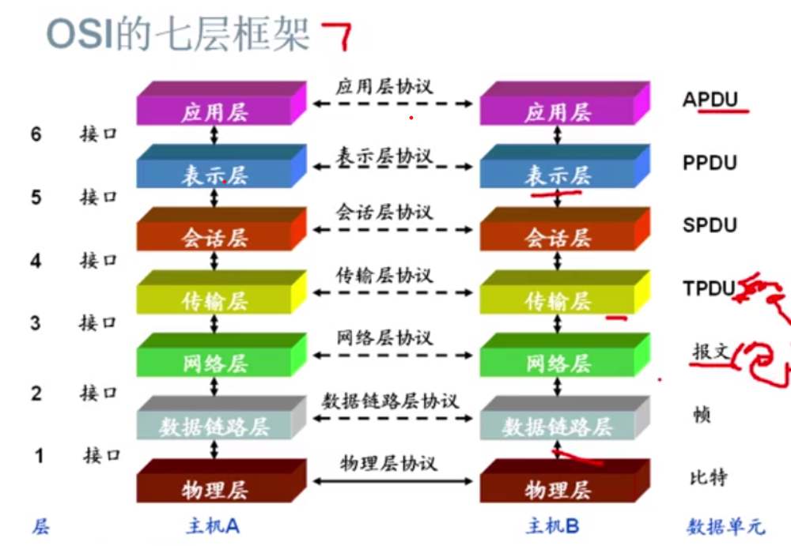
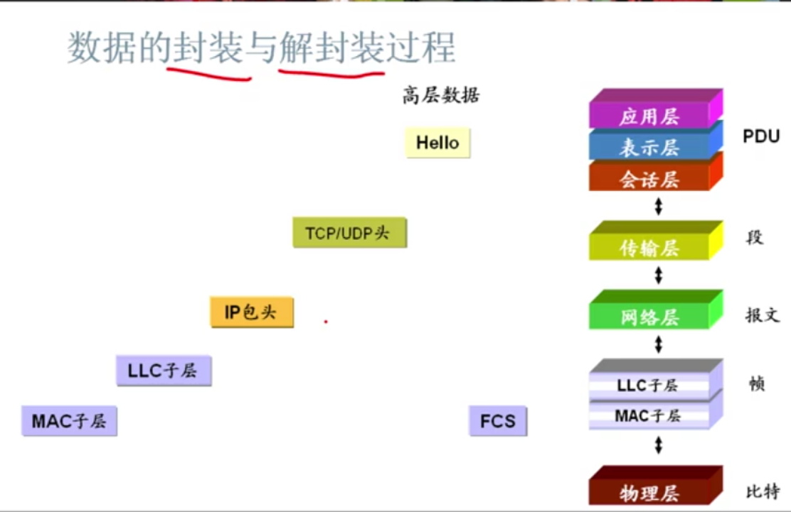

## OSI模型

### 计算就网络的功能
    数据通信

### 协议
    就是一种规范。

###  协议分层
    网络通信的过程很复杂,为了降低网络设计复杂程度，有了分层。

### OSI协议模型
    Open System Internetwork

### 服务与服务访问点
    服务： 事网络中各层向器相邻上层提供的一组操作。
    服务访问点(SAP)： N + 1层试题事通过N层的SAP来使用N层锁提供的服务。
    SAP相当与相邻层之间的接口。 

### OSI的七层框架

|层|数据单元|
|:---:|:---:|
|应用层|APDU(协议数据单元)|
|表示层|PPDU|
|会话层|SPDU|
|传输层|TPDU(数据段)|
|网络层|报文(包)|
|数据链路层|帧|
|物理层|比特(比特流)|

note : 每层之间有个SAP

应用(上)层:
- 应用层(人机接口): 用户接口 (TElnet/FTP)
- 表示层(翻译官)：如何表示数据、特殊处理(加密) (ASCII/EBCDIC/JPEG)
- 会话层: 将不同应用程序的数据分开(操作系统/应用程序访问调度)

数据流层
- 传输层： 可靠或者不可靠的递送、重传前的差错检测(TCP/UDP/SPX)
- 网络层(router)： 提供逻辑地址，供路由器用来确定路径(IP/IPX)
- 数据链路层(switch)： 物理地址(MAC)、(第一层开始封装)将比特组合成字节，再将字节组合成帧、检测(但不更正)差错,如果出错，申请重传(802.3/802.2)
- 物理层：在设备之间传输比特，规定电平、线速和电缆针脚  

### 数据的封装和解封装

