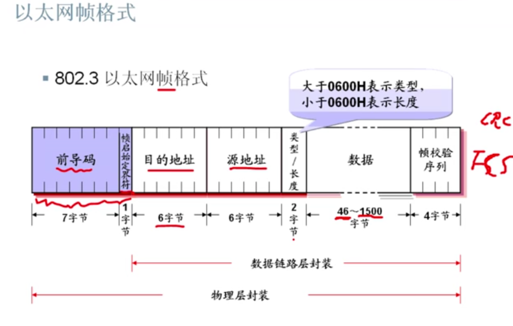

## 数据链路层与交换机

###数据链路层功能

bit -> frame -> packet
- 物理地址
- 封装数据成帧
- 差错检测(重新发送)

###  什么是以太网
以太网工作再数据链路层

LAN -> 局域网 :{
    1. 以太网
}

WAN -> 广域网

#### 以太网解决的三个问题
1. 共享线路的情况下，保证数据不冲突？
    CSMA/CD: 发送前监听信道，如果有冲突就等。
2. 主机地址的问题？
    MAC地址: 48位 [24bit 供应商标识] + [24bit 供应商对网卡的唯一编号]
    第八位 0 - 单播地址
           1 - 组播地址
3. 如何保证数据格式统一(协议)？

### 以太网帧

### MAC子层与LLC子层
#### 介质访问控制(MAC)子层(802.3)
- 封装： 将上层交下来的数据封装成帧进行发送(接收时进行相反的过程，将帧拆卸)
- 实现和维护介质访问控制协议，例CSMA/CD
- 校验： 比特差错检查
- 寻址： MAC帧的寻址，即MAC帧有那个站发出，被哪个站接收。

### 逻辑链路控制(LLC)子层(802.2)
- 建立和释放数据链路层的逻辑连接
- 提供与上层的接口(ICP)
- 给帧加上序号

### 以太网命名方法
N-信号-物理介质
N： 以兆为单位的数据速率，如10、100、1000
信号： 基带还是宽带
物理介质： 标识介质类型
例如： 1000BASE-TX

### 以太网交换机
交换机是用来连接局域网的主要设备

### 交换机数据转发原理
- 转发 交换机根据MAC地址表单播转发数据帧
- 学习 MAC地址表是交换机通过学习接收的数据帧的源MAC地址来形成的
- 广播 如果目标地址再MAC地址表中没有，交换机就向除接收到该数据帧的端口外
的其他所有端口广播该数据帧
- 更新　交换机MAC地址表的老化时间是300秒，交换机如果发现一个帧的入口段的MAC地址表中源MAC地址的所在端口不同，
交换机将MAC地址重新学习到新的端口

### 单工、半双工、全双工
- 单工： 只有一个信道，传输方向是单向的(收音机)
- 半双工： 对讲机
- 全双工： 电话

### 冲突与冲突域

交换机可以隔离解决冲突域

### 交换机内部交换方式
- 存储转发： 接受完整帧后，校验转发
- 快速转发： 看到目的地址就转发
- 分段过滤(Fragment FRee): 收到64字节后转发 6 + 6 + 2 + 46 + 4 = 64

    

