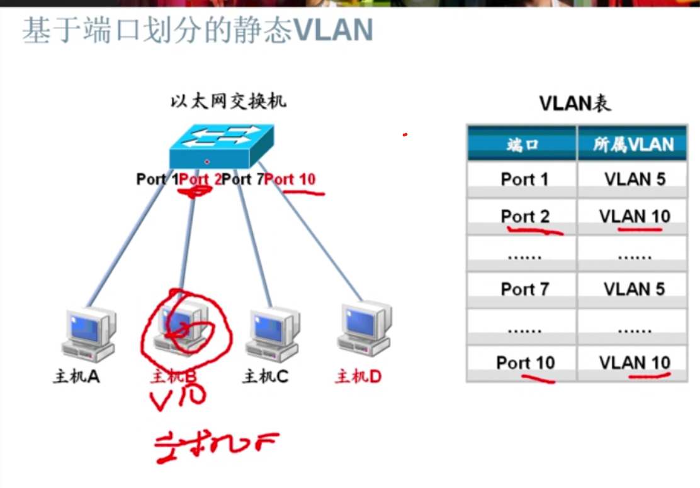
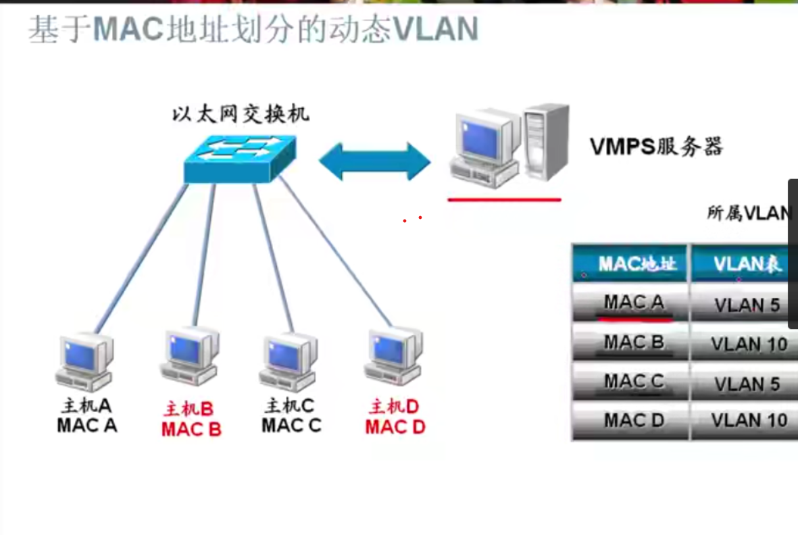

# VLAN
## VLAN概述
Virtual LAN(虚拟局域网)  逻辑上划分物理上需要隔离的网络
分割广播域

## VLAN作用
- 广播控制
- 安全性
- 带宽利用
- 降低延迟

## VLAN种类
- 基于端口划分的静态VLAN
- 基于MAC地址划分的动态VLAN

## 基于端口划分的静态VLAN

## 基于MAC地址划分的动态VLAN

## Cisco交换机上静态VLANde 配置
- 配置VLAN的步骤
  + 创建VLAN 
  + 将端口加入到相应的VLAN中
  + 验证

