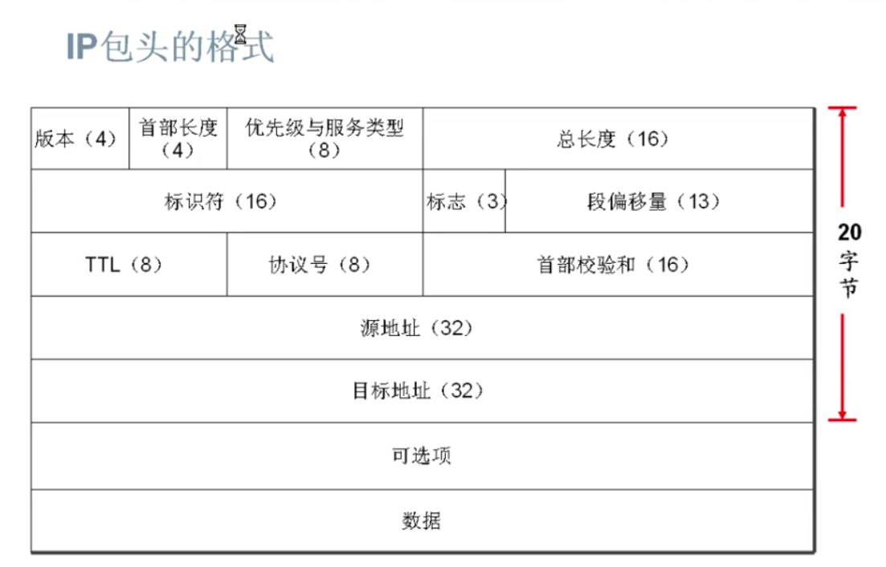
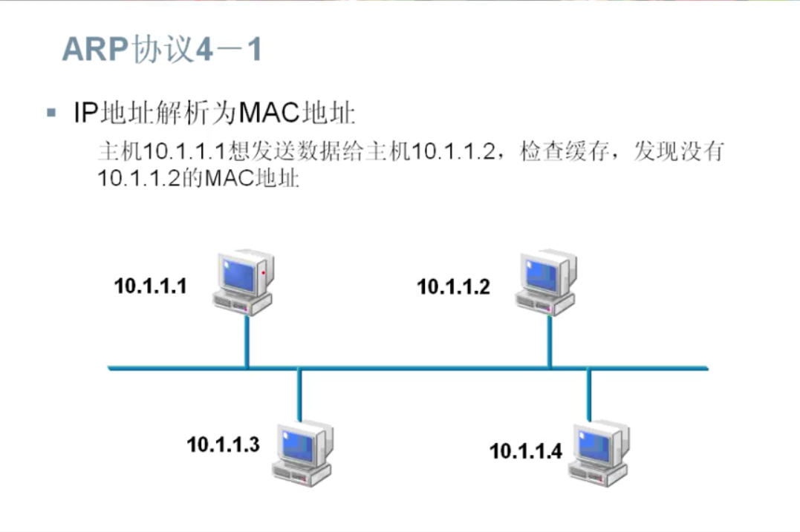

# 网络层协议
## IP包头的格式

版本(4): ipv4/ipv6
首部长度(4): IP包头长度，因为长度可变，所以需要定义(一般是20字节)
优先级与服务类型： 优先级与服务类型，提供三层的Qos
总长度： IP包的总长度
标识符(16)、标志(3)、段偏移量(13)： 上层来的数据到IP层会被分段，这几个字段用来对数据包
进行标识，使在数据打倒目的端重组的时候不会乱序。
TTL(8): 生命周期字段，经过一个路由器值减一，为零时，数据包丢弃。
为了防止一个数据包在网络中无线的循环下去(第三层的环路)。
协议号(8): 上层的协议类型 tcp = 6 udp = 17
首部校验和(16): 校验包头正确性
源地址(32): 
目的地址(32): 
可选项： 
数据： 

## ARP协议

1. ARP Cache 表 Internet Adress -> Physical Adress 
2. 如果没有 ARP广播 , 找到后 ARP Cache ... type Dynamic

## ARP缓存查询
- Windows: arp -a
- Cisico: show ip arp

## RARP协议
已知对方IP找对方的MAC

## 代理ARP
在不同网段通信,代理回应

## ICMP协议
- ICMP消息通过IP数据保传送，被用来发送错误和控制信息。
- ICMP定义了很多信息类型，例如：
    目的地不可达
    信息请求
    信息应答
    地址请求
    地址应答

## ICMP协议的应用
    Ping 
